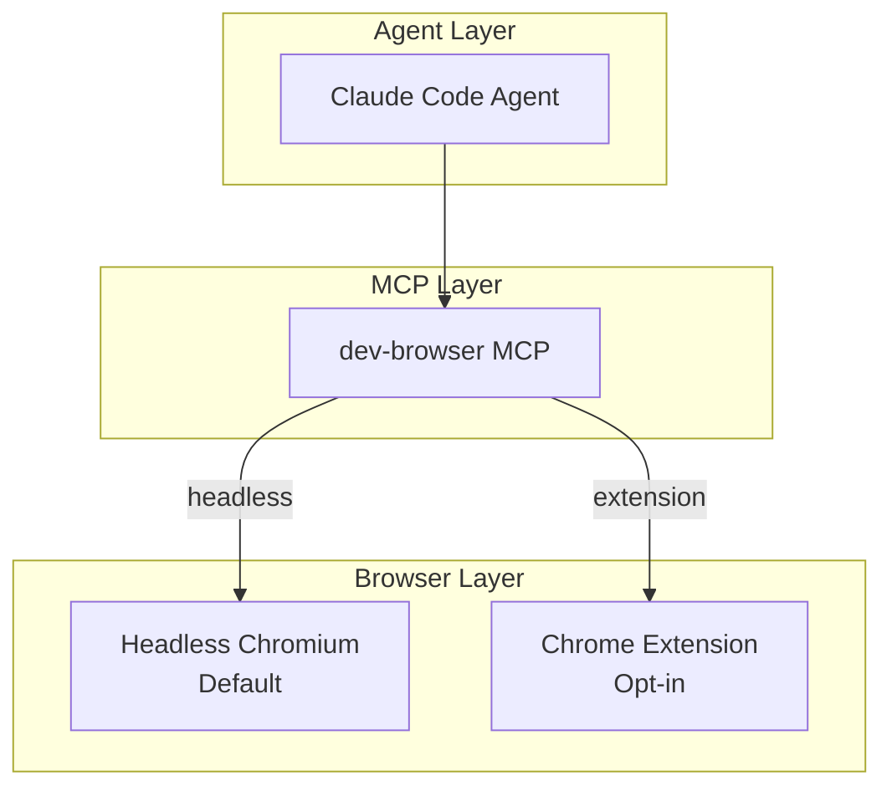
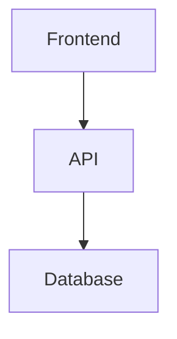

# Browser Automation Protocol

**Version:** 1.0.0
**Status:** Active
**Date:** 2026-02-02

## Purpose

This protocol defines standards for agent browser automation in Loa. Browser automation enables agents to take screenshots, interact with web pages, test authenticated contexts, and perform visual verification tasks.

## Architecture



## Modes

### Headless Mode (Default)

Headless mode launches an isolated Chromium instance with no user data.

| Property | Value |
|----------|-------|
| **Isolation** | Complete - fresh profile per session |
| **Privacy** | High - no access to user data |
| **Use Cases** | Screenshots, form testing, web scraping |
| **Dependencies** | Node.js 18+, Chromium (auto-installed) |

**Configuration:**
```yaml
# .loa.config.yaml
agent_browser:
  enabled: true
  mode: "headless"
```

**MCP Setup:**
```json
{
  "mcpServers": {
    "dev-browser": {
      "command": "npx",
      "args": ["@anthropic/dev-browser-mcp"],
      "env": {
        "DEV_BROWSER_HEADLESS": "true"
      }
    }
  }
}
```

### Extension Mode (Opt-in)

Extension mode connects to an existing Chrome browser via the dev-browser Chrome extension.

| Property | Value |
|----------|-------|
| **Isolation** | Limited - uses existing Chrome profile |
| **Privacy** | Low - can access sessions, bookmarks, cookies |
| **Use Cases** | Authenticated screenshots, wallet testing |
| **Dependencies** | Chrome, dev-browser extension installed |

> **WARNING:** Extension mode can access sensitive user data. Use only with explicit user consent and a dedicated Chrome profile.

**Configuration:**
```yaml
# .loa.config.yaml
agent_browser:
  enabled: true
  mode: "extension"
  session_persistence: true
```

**MCP Setup:**
```json
{
  "mcpServers": {
    "dev-browser": {
      "command": "npx",
      "args": ["@anthropic/dev-browser-mcp", "--extension"],
      "env": {
        "DEV_BROWSER_PROFILE": "claude-code"
      }
    }
  }
}
```

## Use Cases

### 1. Screenshots for Documentation

Capture web pages for inclusion in documentation.

```bash
# Agent workflow
1. Navigate to URL
2. Wait for page load
3. Take screenshot
4. Save to grimoires/loa/screenshots/
```

**Output Location:** `grimoires/loa/screenshots/`

### 2. Visual Verification

Verify that deployed applications render correctly.

```bash
# Agent workflow
1. Navigate to deployed URL
2. Check for expected elements
3. Capture screenshot as evidence
4. Report findings
```

### 3. Authenticated Context Testing (Extension Mode Only)

Test pages that require authentication without exposing credentials.

**Use Case: Wallet Address Mocking (from issue #135)**

> "extension capability does seem helpful for cases like mocking user addresses, which is a need for one of the constructs i'm building"

**Workflow:**
1. User confirms extension mode usage
2. Agent connects to Chrome with wallet extension
3. Agent navigates to dApp
4. Agent captures authenticated state
5. Agent disconnects

### 4. Form Interaction Testing

Fill and submit forms to test application behavior.

```bash
# Agent workflow
1. Navigate to form page
2. Fill form fields
3. Submit form
4. Verify response
5. Capture result screenshot
```

## Security Model

### Headless Mode Security

| Control | Implementation |
|---------|----------------|
| Isolation | Fresh Chromium profile per session |
| Network | No proxy, direct connections |
| Persistence | None - all data cleared on exit |
| File Access | Limited to screenshot directory |

### Extension Mode Security

| Control | Implementation |
|---------|----------------|
| User Consent | Required before first use |
| Profile Separation | Dedicated Chrome profile recommended |
| Session Access | Can read cookies, localStorage |
| Wallet Access | Can interact with browser extensions |

**Security Warnings for Extension Mode:**

1. **Data Exposure:** Extension mode can access all data in the connected Chrome profile
2. **Session Hijacking:** Authenticated sessions are accessible to the agent
3. **Extension Interaction:** The agent can interact with any installed Chrome extensions
4. **Credential Exposure:** Saved passwords may be accessible

**Mitigation:**

1. Create a dedicated Chrome profile for Claude Code
2. Only install necessary extensions in that profile
3. Log out of sensitive accounts before extension mode
4. Review agent actions in trajectory logs

## Integration with Visual Communication

Browser automation complements the Visual Communication protocol for diagram rendering:

| Mode | Visual Communication | Browser Automation |
|------|---------------------|-------------------|
| **Diagrams** | GitHub native, local render | Screenshots of live pages |
| **Static** | SVG/PNG from Mermaid | PNG from web pages |
| **Dynamic** | Not supported | Full page interaction |

**Example: Architecture Diagram + Live Screenshot**

```markdown
### System Architecture



### Live Dashboard Screenshot


> Captured via dev-browser at 2026-02-02 10:30 UTC
```

## Configuration Reference

```yaml
# .loa.config.yaml
agent_browser:
  enabled: false              # Opt-in (default: false)
  tool: "dev-browser"         # MCP server to use
  mode: "headless"            # headless | extension
  session_persistence: true   # Keep sessions between calls
  screenshot_dir: "grimoires/loa/screenshots/"
  timeout_ms: 30000           # Navigation timeout
```

## Error Handling

### Browser Not Available

```
Error: Browser automation not available

Resolution:
1. Install Node.js 18+: brew install node
2. Install MCP server: npm install -g @anthropic/dev-browser-mcp
3. Enable in config: agent_browser.enabled: true
```

### Extension Mode Connection Failed

```
Error: Could not connect to Chrome extension

Resolution:
1. Install Chrome extension from dev-browser docs
2. Launch Chrome with correct profile
3. Verify extension is active
```

### Screenshot Directory Not Writable

```
Error: Cannot write to screenshot directory

Resolution:
1. Create directory: mkdir -p grimoires/loa/screenshots/
2. Check permissions: chmod 755 grimoires/loa/screenshots/
```

## Graceful Degradation

When browser automation is unavailable, agents should:

1. **Skip** browser-dependent features
2. **Document** the limitation in output
3. **Suggest** alternative approaches (e.g., manual verification)

**Example:**

```markdown
> **Note:** Browser automation not available. Screenshots not included.
> Verify deployment manually at: https://example.com
```

## Paradigm Rivet Inspiration

The extension mode design is inspired by [Paradigm's Rivet](https://www.paradigm.xyz/2023/08/rivet) Ethereum DevTools:

- **Local-first:** Controls existing browser rather than launching new
- **Extension-based:** Works via Chrome extension
- **Developer-focused:** Designed for testing and debugging
- **Composable:** Integrates with existing development workflow

## Installation

### 1. Install MCP Server

```bash
npm install -g @anthropic/dev-browser-mcp
```

### 2. Configure Loa

```yaml
# .loa.config.yaml
agent_browser:
  enabled: true
  mode: "headless"
```

### 3. Add MCP Configuration

Copy from `.claude/mcp-examples/dev-browser.json` to your MCP settings.

### 4. (Optional) Extension Mode Setup

1. Install dev-browser Chrome extension
2. Create dedicated Chrome profile: `claude-code`
3. Set `mode: "extension"` in config
4. Launch Chrome with `--profile-directory="claude-code"`

## Related

- `.claude/mcp-examples/dev-browser.json` - MCP configuration example
- `.claude/protocols/visual-communication.md` - Diagram rendering
- `.loa.config.yaml` - Configuration reference
- [dev-browser Documentation](https://github.com/SawyerHood/dev-browser)
