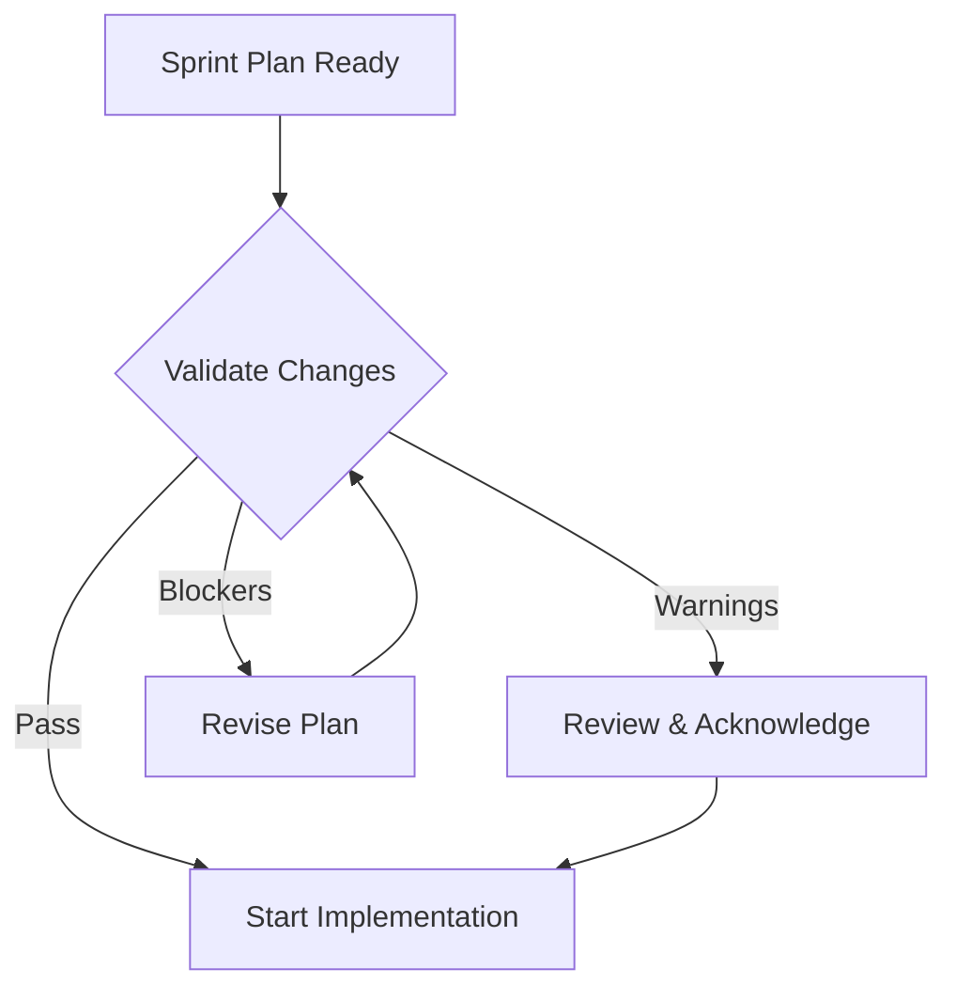

# Change Validation Protocol

Protocol for validating proposed changes against codebase reality before implementation.

---

## Purpose

Ensure that:
1. Changes are grounded in actual codebase structure
2. Referenced files and functions exist
3. Dependencies are available
4. Breaking changes are explicitly acknowledged
5. Conflicts are identified early

---

## When to Apply

Apply change validation:

- Before starting `/implement` sprint tasks
- When planning major refactoring
- After updating PRD/SDD with new requirements
- When integrating external contributions
- Before merging branches with significant changes

---

## Validation Checklist

### 1. File Reference Validation

```bash
# Extract and validate file references
.claude/scripts/validate-change-plan.sh grimoires/loa/sprint.md
```

**Check that:**
- [ ] All referenced source files exist
- [ ] Directory structure matches expectations
- [ ] No typos in file paths

### 2. Function/Method Validation

**Check that:**
- [ ] Functions to be modified exist
- [ ] Function signatures match expectations
- [ ] No deprecated functions being extended

### 3. Dependency Validation

**Check that:**
- [ ] New dependencies are explicitly listed
- [ ] Existing dependencies are compatible
- [ ] No version conflicts introduced

### 4. Breaking Change Detection

**Check that:**
- [ ] API changes are documented
- [ ] Schema migrations are planned
- [ ] Downstream consumers are identified
- [ ] Rollback plan exists

---

## Validation Levels

### Level 1: Quick Check (Default)
- File existence
- Basic syntax in plan
- Obvious conflicts

**Run time:** ~5 seconds

### Level 2: Standard Check
- All Level 1 checks
- Function existence
- Dependency availability
- Git status conflicts

**Run time:** ~30 seconds

### Level 3: Deep Check
- All Level 2 checks
- Breaking change analysis
- Test coverage impact
- Performance implications

**Run time:** ~2 minutes

---

## Integration with Workflow

### Before Sprint Implementation



### Validation in Preflight

Commands like `/implement` should include validation:

```yaml
pre_flight:
  - check: "script_passes"
    script: ".claude/scripts/validate-change-plan.sh"
    args: ["grimoires/loa/sprint.md"]
    error: "Change plan validation failed. Review warnings."
```

---

## Handling Validation Results

### Warnings (Exit Code 1)

Warnings indicate potential issues but don't block:

| Warning | Action |
|---------|--------|
| File not found | Verify path or confirm new file |
| Function not found | Confirm new function or fix reference |
| Uncommitted changes | Commit or stash before modifying |
| Dependency not installed | Add to package.json or requirements.txt |

### Blockers (Exit Code 2)

Blockers require explicit resolution:

| Blocker | Resolution |
|---------|------------|
| Breaking changes | Document migration path |
| Schema conflicts | Plan migration script |
| Security implications | Get security review |

---

## Evidence Requirements

All validated plans should include:

### For File Modifications

```markdown
## File: src/handlers/badge.ts

**Current state (validated):**
- Lines: 245
- Functions: 8
- Last modified: 2024-01-15

**Proposed changes:**
- Add new handler function at line 200
- Modify validateBadge() signature
```

### For New Files

```markdown
## New File: src/handlers/rewards.ts

**Validation:**
- [ ] Directory exists: src/handlers/
- [ ] No naming conflicts
- [ ] Follows naming convention

**Dependencies:**
- Imports from: src/utils/math.ts (exists)
- Imports from: src/types/index.ts (exists)
```

### For Deletions

```markdown
## Delete: src/legacy/oldHandler.ts

**Validation:**
- [ ] No imports of this file found
- [ ] Not referenced in tests
- [ ] Not in CODEOWNERS critical paths

**Evidence:**
```bash
grep -r "oldHandler" src/ # No results
```
```

---

## Automation

### Git Hook Integration

Add to `.git/hooks/pre-commit`:

```bash
#!/bin/bash
if [[ -f "grimoires/loa/sprint.md" ]]; then
  .claude/scripts/validate-change-plan.sh grimoires/loa/sprint.md
  if [[ $? -eq 2 ]]; then
    echo "❌ Blocking validation errors. Fix before committing."
    exit 1
  fi
fi
```

### CI Integration

Add to CI pipeline:

```yaml
validate:
  runs-on: ubuntu-latest
  steps:
    - uses: actions/checkout@v4
    - name: Validate change plan
      run: |
        if [[ -f "grimoires/loa/sprint.md" ]]; then
          .claude/scripts/validate-change-plan.sh grimoires/loa/sprint.md
        fi
```

---

## NOTES.md Integration

After validation, log results:

```markdown
## Decision Log
| Date | Decision | Rationale | Decided By |
|------|----------|-----------|------------|
| [date] | Proceed with sprint-5 implementation | Validation passed with 2 warnings (acknowledged) | engineering |
```

---

## Related Scripts

- `.claude/scripts/validate-change-plan.sh` - Main validation script
- `.claude/scripts/detect-drift.sh` - Drift detection for ongoing monitoring
- `.claude/scripts/check-prerequisites.sh` - Phase prerequisite checks
