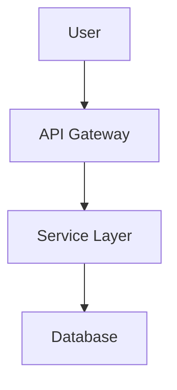
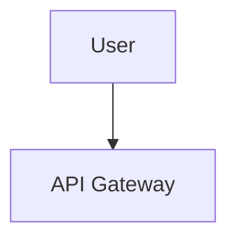
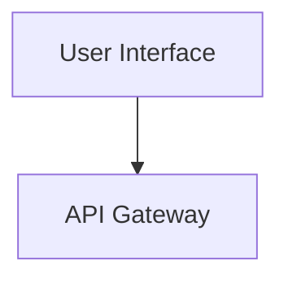
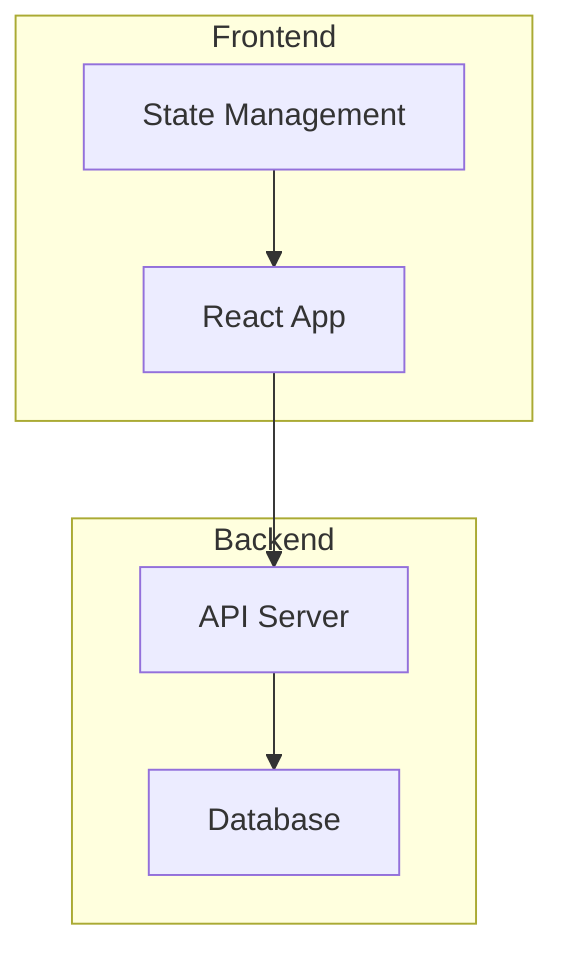

# Visual Communication Protocol

**Version:** 2.0.0
**Status:** Active
**Date:** 2026-02-02

## Purpose

This protocol defines standards for visual output across all Loa agents using Mermaid diagrams. Version 2.0 introduces a three-mode rendering strategy with GitHub native as the default, replacing the broken external service dependency.

## Rendering Modes

| Mode | Output | Use Case | Dependencies |
|------|--------|----------|--------------|
| **GitHub Native** (default) | `\`\`\`mermaid` code block | All markdown docs | None |
| **Local Render** | SVG/PNG files | Image exports | Node.js, mermaid-cli |
| **URL (legacy)** | Preview URL | External sharing | External service |

### Mode Selection Priority

1. Explicit flag (`--github`, `--render`, `--url`)
2. Config `visual_communication.mode`
3. Default: `github`

## When to Include Diagrams

### Required (Must Include)

| Agent | Required Diagrams |
|-------|-------------------|
| designing-architecture | System architecture, component interactions, data models, state machines |
| translating-for-executives | Executive summary diagrams, high-level flows |

### Optional (Agent Discretion)

| Agent | Suggested Diagrams |
|-------|-------------------|
| discovering-requirements | User journeys, process flows |
| planning-sprints | Sprint workflow, task dependencies |
| reviewing-code | Code flow diagrams |

## Diagram Type Selection

| Type | Mermaid Syntax | Use Case |
|------|----------------|----------|
| **Flowchart** | `graph TD` / `graph LR` | System architecture, process flows, decision trees |
| **Sequence** | `sequenceDiagram` | API interactions, agent communication, request flows |
| **Class** | `classDiagram` | Object models, type relationships, domain models |
| **State** | `stateDiagram-v2` | State machines, lifecycle diagrams, status flows |
| **ER** | `erDiagram` | Database schemas, data models, entity relationships |

## Output Formats

### GitHub Native (Default)

The default output format for all Loa documents:

```markdown
### Component Architecture


```

**Benefits:**
- Zero external dependencies
- GitHub renders automatically in markdown preview
- Works in PRs, issues, and wiki
- No privacy concerns (source code only)
- No character limits

### Local Render (Optional)

When image files are needed:

```markdown
### Component Architecture



> **Rendered**: [View SVG](grimoires/loa/diagrams/diagram-abc12345.svg)
```

**Use Cases:**
- Documentation exports (PDF generation)
- Presentations
- Privacy-sensitive diagrams (no external service)
- Offline rendering

### Preview URL (Legacy)

For backwards compatibility when explicitly configured:

```markdown
### Component Architecture


> **Preview**: [View diagram](https://agents.craft.do/mermaid?code=...&theme=github)
```

**Note:** The default external service (`agents.craft.do/mermaid`) is unreliable. Use GitHub native or local render instead.

## Script Usage

### Generate GitHub Native (Default)

```bash
# From stdin
echo 'graph TD; A-->B' | .claude/scripts/mermaid-url.sh --stdin

# From file
.claude/scripts/mermaid-url.sh diagram.mmd
```

### Generate Local Render

```bash
# Default SVG output
echo 'graph TD; A-->B' | .claude/scripts/mermaid-url.sh --stdin --render

# PNG with theme
echo 'graph TD; A-->B' | .claude/scripts/mermaid-url.sh --stdin --render --format png --theme dracula

# Custom output directory
echo 'graph TD; A-->B' | .claude/scripts/mermaid-url.sh --stdin --render --output-dir /tmp/diagrams
```

### Generate Legacy URL

```bash
echo 'graph TD; A-->B' | .claude/scripts/mermaid-url.sh --stdin --url
```

### Check Configuration

```bash
.claude/scripts/mermaid-url.sh --check
```

## Theme Configuration

### Available Themes

| Theme ID | Description | Best For |
|----------|-------------|----------|
| `github` | GitHub light mode | Documentation, PRs (default) |
| `dracula` | Dark purple | Dark mode users |
| `nord` | Arctic blue | Accessibility |
| `tokyo-night` | Dark blue | IDE integration |
| `solarized-light` | Warm light | Print-friendly |
| `solarized-dark` | Warm dark | Low-light environments |
| `catppuccin` | Pastel dark | Modern aesthetic |

### Reading Theme

Agents should read theme from `.loa.config.yaml`:

```yaml
visual_communication:
  theme: "github"  # Default theme
```

## Configuration Reference

```yaml
# .loa.config.yaml
visual_communication:
  enabled: true                              # Master toggle
  mode: "github"                             # Default mode: github | render | url
  theme: "github"                            # Default theme

  # Local rendering options
  local_render:
    output_format: "svg"                     # svg | png
    output_dir: "grimoires/loa/diagrams/"    # Output directory

  # Legacy URL options (for mode: url)
  service: "https://agents.craft.do/mermaid" # External service URL
  include_preview_urls: false                # Generate preview links
```

## Local Rendering Dependencies

For `--render` mode, install mermaid-cli:

```bash
# Global install
npm install -g @mermaid-js/mermaid-cli

# Or use npx (auto-installs on first use)
npx @mermaid-js/mermaid-cli --version
```

**Requirements:**
- Node.js >= 18
- Chrome/Chromium (for PNG rendering)

## Mermaid Syntax Requirements

### General Rules

1. Use clear, descriptive node labels
2. Prefer `TD` (top-down) for hierarchical diagrams
3. Prefer `LR` (left-right) for process flows
4. Keep diagrams focused - split complex systems into multiple diagrams
5. Use subgraphs to group related components

### Node Naming



### Subgraph Usage



## Integration with Skills

### SKILL.md Reference

Skills that support visual communication should include:

```markdown
<visual_communication>
## Visual Communication

Follow `.claude/protocols/visual-communication.md` for diagram standards.

### Output Format

Use GitHub native Mermaid code blocks (default). Example:

\`\`\`mermaid
graph TD
    A[Component] --> B[Other]
\`\`\`

For image exports, use `--render` mode.
</visual_communication>
```

## Privacy & Security

### GitHub Native Mode

- No external data transmission
- Source code stays local
- No privacy concerns

### Local Render Mode

- Full privacy (no external service)
- Requires local Node.js + mermaid-cli
- Suitable for sensitive architecture diagrams

### URL Mode (Legacy)

Diagram content is encoded in the URL and sent to external service.

**What's sent:**
- Mermaid source code (base64 URL-encoded)
- Theme parameter

**Privacy Recommendation:**
For diagrams containing proprietary architecture or security-sensitive details, use `github` or `render` mode.

### Input Validation

The `mermaid-url.sh` script validates:
- Theme names against an allowlist (prevents injection)
- Output format against allowlist
- Basic Mermaid syntax (requires valid diagram type)
- Config values (only allows safe characters)

## Migration from v1.x

### Breaking Changes

1. **Default mode changed**: Now outputs GitHub native code blocks, not preview URLs
2. **Preview URLs disabled by default**: Set `include_preview_urls: true` for legacy behavior

### Migration Steps

1. **No action required** for most users - GitHub native works everywhere
2. If you need preview URLs, add to config:
   ```yaml
   visual_communication:
     mode: "url"
     include_preview_urls: true
   ```
3. Remove broken preview URLs from existing docs:
   ```bash
   grep -r "agents.craft.do/mermaid" grimoires/ --include="*.md" -l | \
     xargs sed -i 's/> \*\*Preview\*\*:.*agents\.craft\.do.*//g'
   ```

## Related

- `.claude/scripts/mermaid-url.sh` - Multi-mode rendering script
- `.loa.config.yaml` - Configuration file
- SDD Section 4 - Component design details
