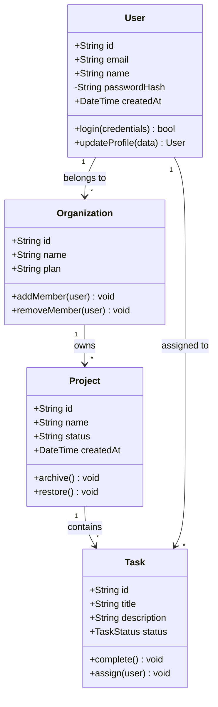
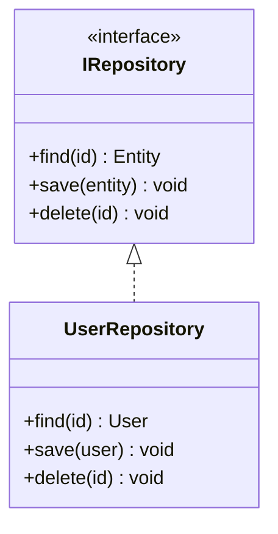
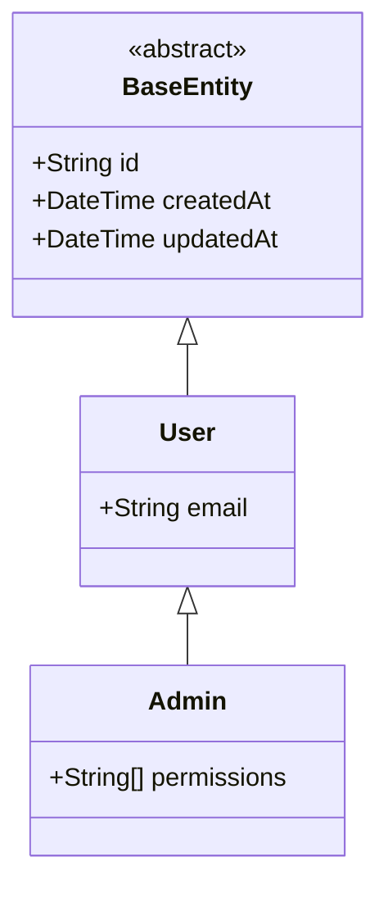
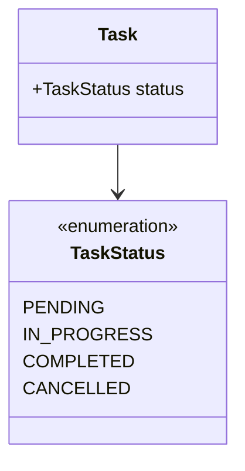

# Domain Model Class Diagram Template

Use this template for object models and type relationships.

## Template



## Preview URL Pattern

```
> **Preview**: [View diagram](https://agents.craft.do/mermaid?code={base64}&theme=github)
```

## Usage Notes

1. **Visibility**:
   - `+` Public
   - `-` Private
   - `#` Protected
   - `~` Package/Internal

2. **Relationships**:
   - `-->` Association
   - `--o` Aggregation
   - `--*` Composition
   - `--|>` Inheritance
   - `..|>` Implementation

3. **Cardinality**: `"1"`, `"*"`, `"0..1"`, `"1..*"`

## Variations

### Interface Implementation


### Inheritance Hierarchy


### Enum Types

