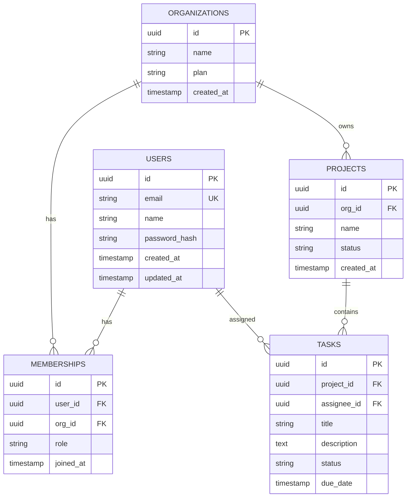
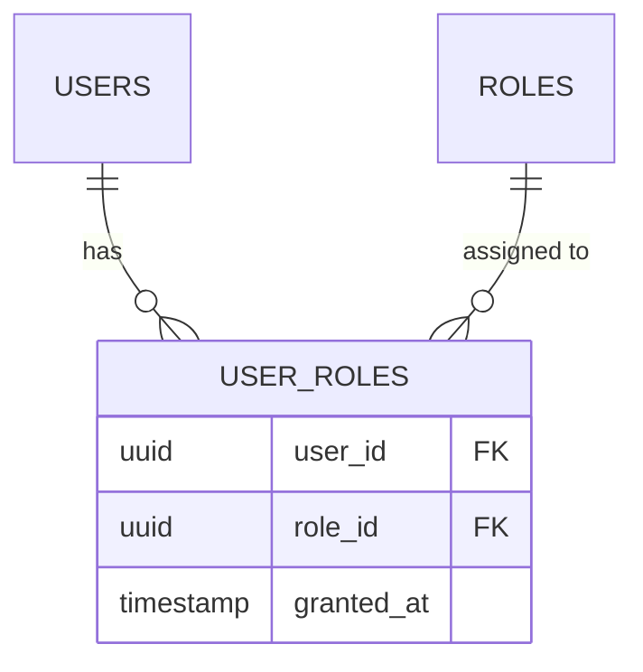
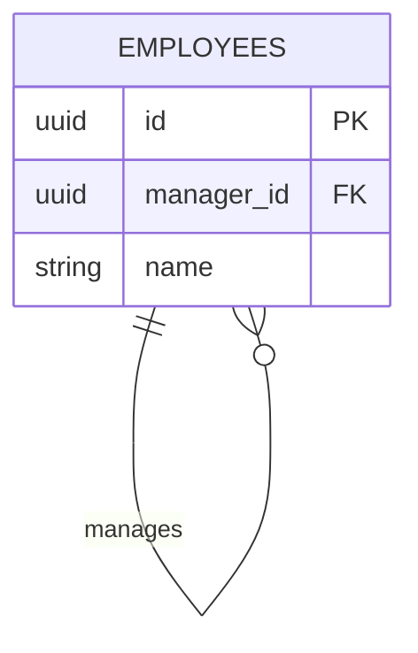
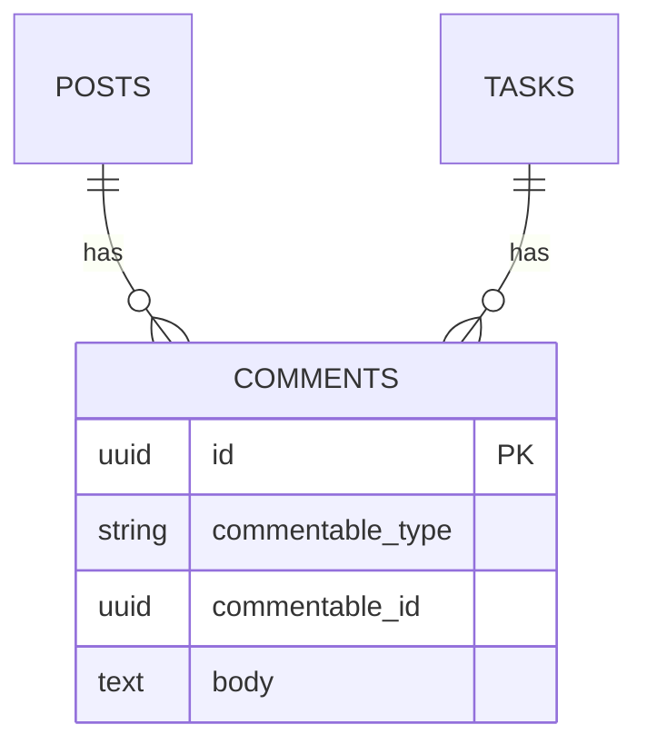
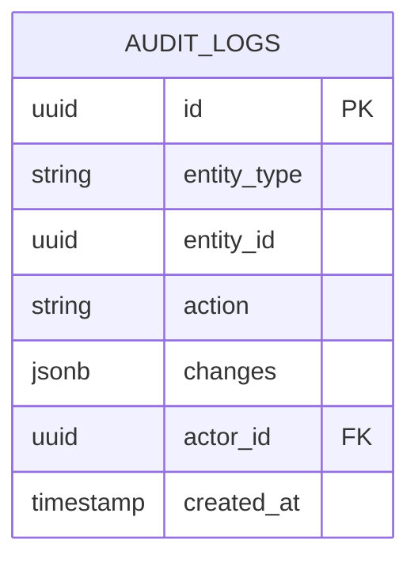

# Database Schema ER Diagram Template

Use this template for database schemas and entity relationships.

## Template



## Preview URL Pattern

```
> **Preview**: [View diagram](https://agents.craft.do/mermaid?code={base64}&theme=github)
```

## Usage Notes

1. **Attribute Markers**:
   - `PK` Primary Key
   - `FK` Foreign Key
   - `UK` Unique Key

2. **Common Types**:
   - `uuid`, `int`, `bigint`
   - `string`, `text`
   - `boolean`
   - `timestamp`, `date`
   - `jsonb`, `array`

3. **Relationships**:
   - `||--||` One to one
   - `||--o{` One to many
   - `o{--o{` Many to many

## Variations

### Junction Table (Many-to-Many)


### Self-Referencing


### Polymorphic Association


### Audit Trail

