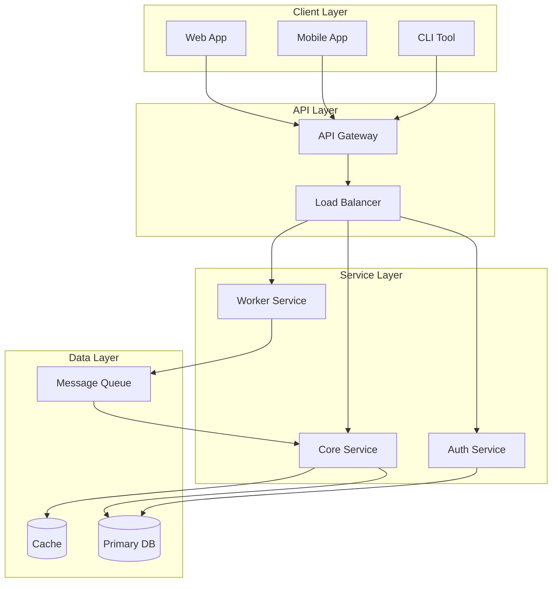
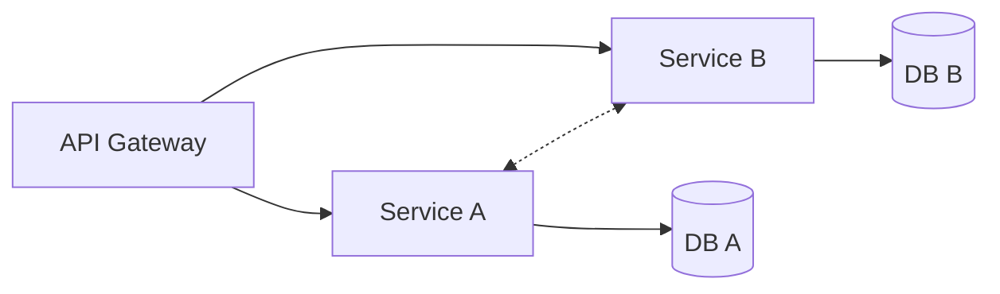
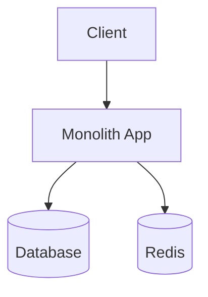

# System Architecture Flowchart Template

Use this template for high-level system architecture diagrams.

## Template



## Preview URL Pattern

```
> **Preview**: [View diagram](https://agents.craft.do/mermaid?code={base64}&theme=github)
```

## Usage Notes

1. **Subgraphs**: Group related components by logical layer
2. **Connections**: Use `-->` for data flow, `-.->` for optional/async
3. **Database nodes**: Use `[( )]` shape for databases
4. **Labels**: Keep concise but descriptive

## Variations

### Microservices Pattern


### Monolith Pattern

