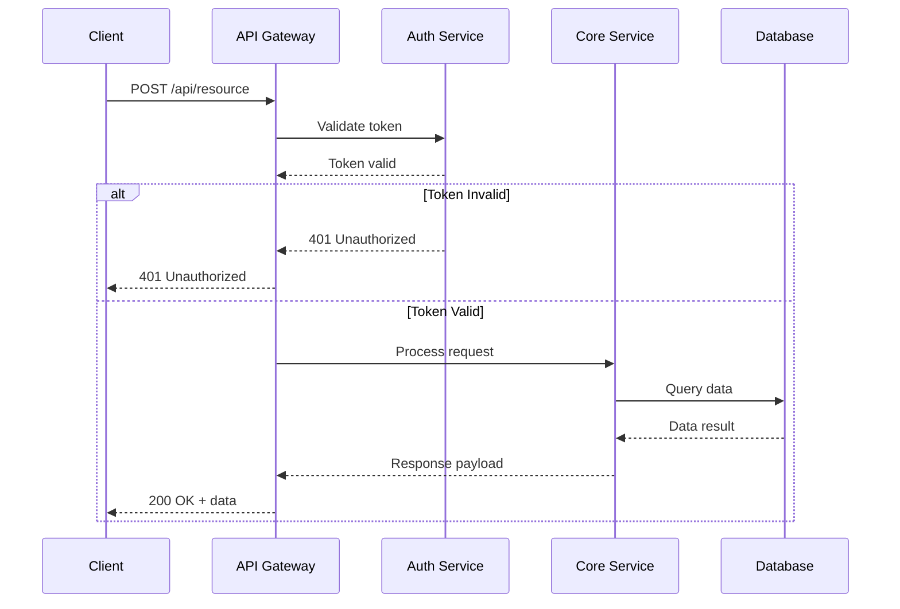
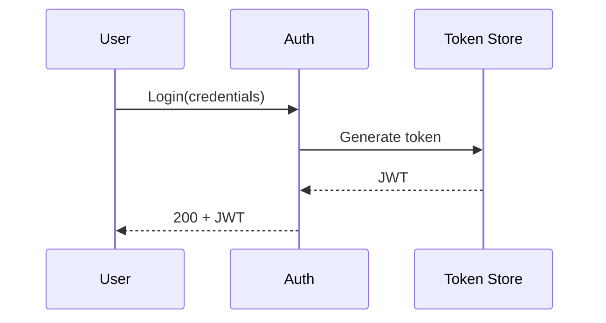
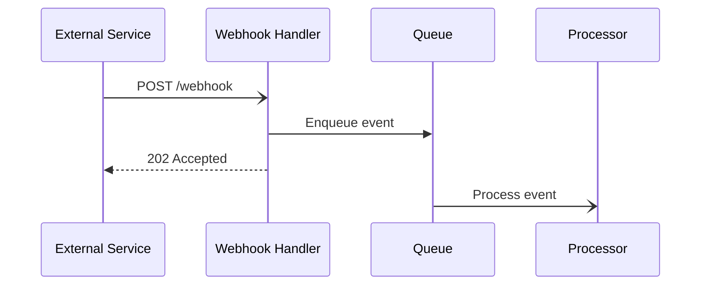
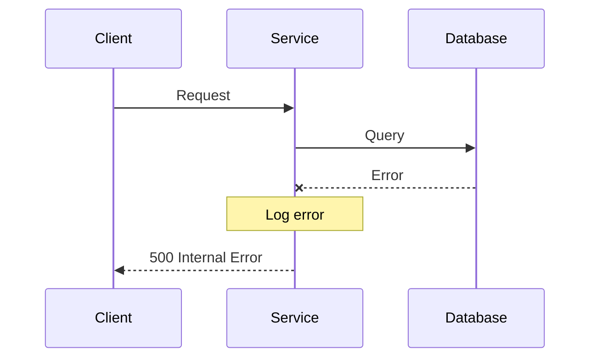

# API Interaction Sequence Template

Use this template for API request flows and service interactions.

## Template



## Preview URL Pattern

```
> **Preview**: [View diagram](https://agents.craft.do/mermaid?code={base64}&theme=github)
```

## Usage Notes

1. **Participants**: Define all actors at the top
2. **Arrows**:
   - `->>` Synchronous request
   - `-->>` Response/return
   - `-)` Async message
3. **Blocks**:
   - `alt/else` for conditionals
   - `opt` for optional flows
   - `loop` for iterations
   - `par` for parallel execution

## Variations

### Authentication Flow


### Webhook Pattern


### Error Handling

