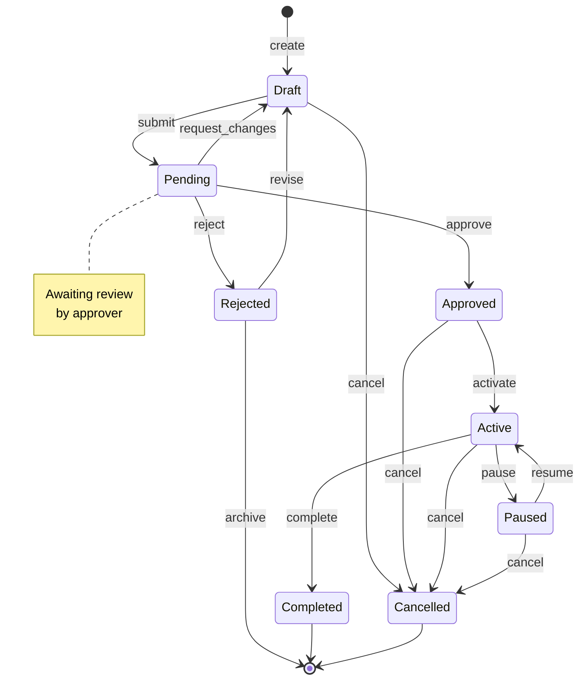
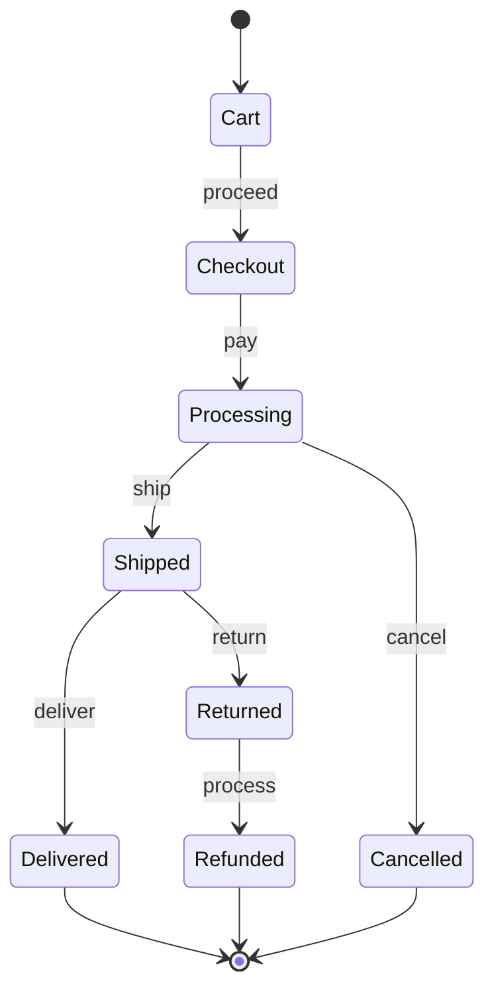
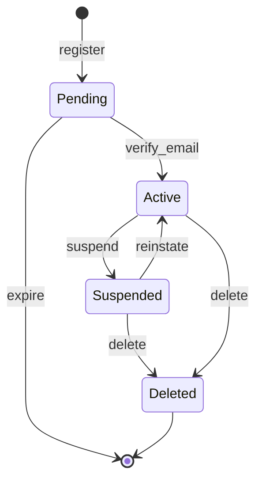
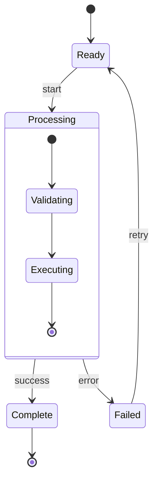
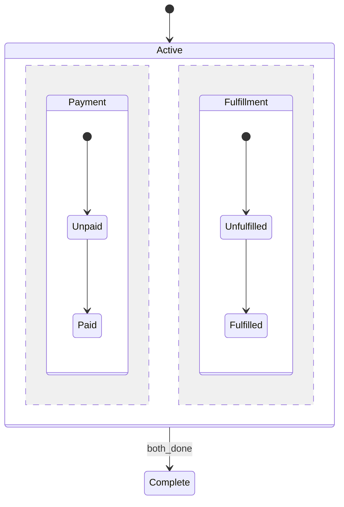

# State Machine / Lifecycle Diagram Template

Use this template for state machines, status flows, and lifecycle diagrams.

## Template



## Preview URL Pattern

```
> **Preview**: [View diagram](https://agents.craft.do/mermaid?code={base64}&theme=github)
```

## Usage Notes

1. **Special States**:
   - `[*]` Start/End state
   - Use arrows from `[*]` for initial state
   - Use arrows to `[*]` for terminal states

2. **Transitions**: `StateA --> StateB : event`

3. **Notes**: `note right of State` / `note left of State`

4. **Direction**: Default is top-down, use `direction LR` for left-right

## Variations

### Order Lifecycle


### User Account States


### Composite States


### Concurrent States

