# Loa Ecosystem — How It All Fits Together

> **ELI5 guide** to how `loa`, `loa-hounfour`, `loa-freeside`, `loa-finn`, `loa-dixie`, and `loa-constructs` connect as an ecosystem for building and operating AI agent economies.

## Architecture Diagram

```mermaid
graph TB
    subgraph "Layer 5: Product"
        DIXIE["🔮 loa-dixie<br/>The Oracle Product"]
    end

    subgraph "Layer 4: Platform"
        FREESIDE["🏗️ loa-freeside<br/>API + Billing + Discord/TG"]
    end

    subgraph "Layer 3: Runtime"
        FINN["⚡ loa-finn<br/>Agent Execution Engine"]
    end

    subgraph "Layer 2: Protocol"
        HOUNFOUR["📜 loa-hounfour<br/>Schemas + Rules + Contracts"]
    end

    subgraph "Layer 1: Framework"
        LOA["🛠️ loa<br/>Dev Framework + Skills"]
    end

    DIXIE -->|"queries knowledge<br/>via platform APIs"| FREESIDE
    DIXIE -->|"runs agent sessions"| FINN
    DIXIE -->|"validates types"| HOUNFOUR

    FREESIDE -->|"routes agents<br/>to model pools"| FINN
    FREESIDE -->|"npm dependency<br/>validates all data"| HOUNFOUR

    FINN -->|"enforces contracts<br/>budget limits"| HOUNFOUR

    LOA -.->|"mounted as dev framework<br/>in ALL repos"| FINN
    LOA -.->|"mounted as dev framework"| FREESIDE
    LOA -.->|"mounted as dev framework"| HOUNFOUR
    LOA -.->|"mounted as dev framework"| DIXIE

    style LOA fill:#4a9eff,stroke:#2d7cd4,color:#fff
    style HOUNFOUR fill:#9b59b6,stroke:#7d3c98,color:#fff
    style FINN fill:#e67e22,stroke:#d35400,color:#fff
    style FREESIDE fill:#2ecc71,stroke:#27ae60,color:#fff
    style DIXIE fill:#e74c3c,stroke:#c0392b,color:#fff
```



## The 5-Layer Stack

| Layer | Repo | Role | Status |
|-------|------|------|--------|
| 5 — Product | `loa-dixie` | dNFT Oracle — first product customer | Designed |
| 4 — Platform | `loa-freeside` | API, Discord/TG, token-gating, billing, IaC | Designed |
| 3 — Runtime | `loa-finn` | Persistent sessions, tool sandbox, memory | Designed |
| 2 — Protocol | `loa-hounfour` | Schemas, state machines, model routing contracts | **Shipping** (v8.3.1) |
| 1 — Framework | `loa` | Agent dev framework, skills, Bridgebuilder | **Shipping** |

Each layer depends only on layers below it. Protocol contracts flow upward: lower layers define contracts, upper layers consume them.

---

## ELI5 — What Each One Does

### `loa` — The Toolbox (Layer 1)

**Think of it as**: A really smart instruction manual that every worker carries.

Loa is the development framework — the set of skills, workflows, and quality gates that AI agents use to build software. Every other repo in the ecosystem has Loa installed inside it. When an AI agent works on *any* repo, Loa tells it how to plan, build, review, and ship. It's the common language all the repos share.

> *"The rules and tools every AI agent follows when building anything."*

---

### `loa-hounfour` — The Rulebook (Layer 2)

**Think of it as**: The legal contracts everyone agrees to before doing business.

Hounfour is a pure schema library — no running code, just definitions. It says "an agent session looks like THIS", "a billing event looks like THAT", "a model request must have THESE fields." It compiles to JSON Schema so TypeScript, Python, Go, and Rust can all validate the same data. It also defines economic rules like "budgets must always add up" (conservation invariants) and governance rules like "who can delegate what."

> *"The shared dictionary and rules that all services use to talk to each other."*

---

### `loa-finn` — The Worker (Layer 3)

**Think of it as**: The actual machine that runs the AI agents.

Finn is the runtime — where agent sessions actually execute. It picks which AI model to use (Claude, GPT, Gemini), enforces time and cost limits, sandboxes tool execution so agents can't break things, and persists conversation history. When you ask an agent to do something, Finn is the engine making it happen.

> *"The server that actually runs AI agents, routes them to models, and keeps them safe."*

---

### `loa-freeside` — The Front Desk (Layer 4)

**Think of it as**: The reception area where users walk in and get connected to agents.

Freeside is the platform layer — it handles everything between users and the runtime. Discord bot? That's Freeside. Telegram bot? Freeside. REST API? Freeside. Billing and payments? Freeside. Token-gated access based on on-chain holdings? Freeside. It's a Rust+TypeScript stack with 20 Terraform modules, a multi-shard Discord gateway, and BigInt micro-USD budget tracking.

> *"The platform that connects real users (via Discord, Telegram, API) to AI agents and handles billing."*

---

### `loa-dixie` — The Product (Layer 5)

**Think of it as**: The first app built using everything below it.

Dixie is the first real product — an "institutional consciousness" for The HoneyJar ecosystem. It's not a chatbot-over-docs; it's an oracle that carries the *full context* of the project and answers questions at any level: engineers get code paths, PMs get user stories, investors get revenue models, community members get plain English. It proves the whole stack works end-to-end.

> *"The first product — an all-knowing oracle that answers anyone's questions about the ecosystem."*

---

## The Full Flow

```
User asks question on Discord
        ↓
   loa-freeside receives it (Discord gateway + auth + billing)
        ↓
   loa-finn runs the agent session (picks model, enforces limits)
        ↓
   loa-hounfour validates every message (schemas + budget rules)
        ↓
   loa-dixie provides the knowledge (the oracle product)
        ↓
   Answer flows back to Discord

   ...and loa (the framework) was used to BUILD all of the above.
```

---

## Where Constructs Network Fits

Constructs aren't a layer in the stack — they're a **cross-cutting distribution plane** that plugs into multiple layers simultaneously. Think of the 5-layer stack as the *infrastructure* and Constructs Network as the *marketplace* that sits alongside it.

```mermaid
graph TB
    subgraph "Distribution Plane"
        CN["🏪 constructs.network<br/>Marketplace + Registry"]
        API["📡 api.constructs.network<br/>REST API + Git-Sync + Licensing"]
    end

    subgraph "Construct Repos"
        OBS["🔬 construct-observer<br/>User Research / Empathy Engine"]
        CRU["🧪 construct-crucible<br/>Testing / Validation Engine"]
        ART["🎨 construct-artisan<br/>Design Physics / Taste"]
        BCN["🔦 construct-beacon<br/>Developer Tools / Integration"]
        GTM["📢 construct-gtm-collective<br/>Go-To-Market"]
        PRO["🔗 construct-protocol<br/>Smart Contract Verification"]
    end

    subgraph "Layer 5: Product"
        DIXIE["🔮 loa-dixie<br/>The Oracle Product"]
    end

    subgraph "Layer 4: Platform"
        FREESIDE["🏗️ loa-freeside<br/>API + Billing + Discord/TG"]
    end

    subgraph "Layer 3: Runtime"
        FINN["⚡ loa-finn<br/>Agent Execution Engine"]
    end

    subgraph "Layer 2: Protocol"
        HOUNFOUR["📜 loa-hounfour<br/>Schemas + Rules + Contracts"]
    end

    subgraph "Layer 1: Framework"
        LOA["🛠️ loa<br/>Dev Framework + Skills"]
    end

    CN -->|"browse + discover"| API
    API -->|"git-sync from<br/>source repos"| OBS
    API -->|"git-sync"| CRU
    API -->|"git-sync"| ART
    API -->|"git-sync"| BCN
    API -->|"git-sync"| GTM
    API -->|"git-sync"| PRO

    OBS -->|"install into"| LOA
    CRU -->|"install into"| LOA
    ART -->|"install into"| LOA
    BCN -->|"install into"| LOA
    GTM -->|"install into"| LOA
    PRO -->|"install into"| LOA

    OBS -->|"emits events via<br/>event envelope schema"| HOUNFOUR
    DIXIE -->|"consumes constructs<br/>as first customer"| LOA

    FREESIDE -.->|"future: marketplace<br/>distribution channel"| CN

    LOA -.->|"mounted in ALL repos"| FINN
    LOA -.->|"mounted in ALL repos"| FREESIDE
    LOA -.->|"mounted in ALL repos"| HOUNFOUR
    LOA -.->|"mounted in ALL repos"| DIXIE

    DIXIE -->|"queries via platform"| FREESIDE
    FREESIDE -->|"routes to runtime"| FINN
    FINN -->|"validates against"| HOUNFOUR

    style CN fill:#f39c12,stroke:#d68910,color:#fff
    style API fill:#f39c12,stroke:#d68910,color:#fff
    style LOA fill:#4a9eff,stroke:#2d7cd4,color:#fff
    style HOUNFOUR fill:#9b59b6,stroke:#7d3c98,color:#fff
    style FINN fill:#e67e22,stroke:#d35400,color:#fff
    style FREESIDE fill:#2ecc71,stroke:#27ae60,color:#fff
    style DIXIE fill:#e74c3c,stroke:#c0392b,color:#fff
    style OBS fill:#1abc9c,stroke:#16a085,color:#fff
    style CRU fill:#1abc9c,stroke:#16a085,color:#fff
    style ART fill:#1abc9c,stroke:#16a085,color:#fff
    style BCN fill:#1abc9c,stroke:#16a085,color:#fff
    style GTM fill:#1abc9c,stroke:#16a085,color:#fff
    style PRO fill:#1abc9c,stroke:#16a085,color:#fff
```



---

### ELI5: What Constructs Are

**Think of it as**: An app store, but for AI agent expertise.

A construct is a named, packaged unit of expert knowledge that you can install into any Loa-managed repo. Install the Observer construct and your AI agent suddenly knows how to do hypothesis-first user research. Install GTM Collective and it can plan go-to-market strategies. Each construct carries:

- **Identity** — a persona with cognitive style and voice
- **Expertise** — domains rated 1-5 with hard boundaries (what it *refuses* to do)
- **Skills** — executable capabilities that become slash commands
- **Events** — structured messages for cross-construct communication

> *"If Loa is the operating system, constructs are the apps."*

---

### The Construct Lifecycle

```
Creator pushes to GitHub repo (e.g., construct-observer)
        ↓
api.constructs.network git-syncs from source
        ↓
constructs.network marketplace lists it (browse, search, ratings)
        ↓
User runs /constructs install observer
        ↓
constructs-install.sh: download → extract → symlink → license validate
        ↓
Skills appear as /slash-commands in Claude Code
        ↓
Agent gains new expertise (user research, gap analysis, etc.)
```

---

### Known Constructs

| Construct | Repo | What It Does | Skills |
|-----------|------|-------------|--------|
| **Observer** | `construct-observer` | Hypothesis-first user research — the empathy engine | 6: observing-users, shaping-journeys, analyzing-gaps, filing-gaps, importing-research, level-3-diagnostic |
| **Crucible** | `construct-crucible` | Testing and validation engine — ground truth from code | 5: grounding-code, diagramming-states, validating-journeys, walking-through, iterating-feedback |
| **Artisan** | `construct-artisan` | Design physics and taste — the aesthetic intelligence | 14: inscribing-taste, synthesizing-taste, surveying-patterns, crafting-physics, animating-motion, styling-material, distilling-components, applying-behavior, rams, next-best-practices, decomposing-feel, analyzing-feedback, iterating-visuals, envisioning-direction |
| **Beacon** | `construct-beacon` | Developer tools and integration — the builder's toolkit | 6: accepting-payments, auditing-content, defining-actions, discovering-endpoints, generating-markdown, optimizing-chunks |
| **GTM Collective** | `construct-gtm-collective` | Turns what engineers build into what markets buy | 8: positioning-product, pricing-strategist, educating-developers, building-partnerships, analyzing-market, crafting-narratives, reviewing-gtm, translating-for-stakeholders |
| **Protocol** | `construct-protocol` | Smart contract verification, tx forensics, dApp QA | 10: contract-verify, tx-forensics, abi-audit, proxy-inspect, simulate-flow, dapp-lint, dapp-typecheck, dapp-test, dapp-e2e, gpt-contract-review |

#### Planned Constructs

| Construct | Status | What It Would Do |
|-----------|--------|-----------------|
| **Herald** | Planned | Grounded product communication from code evidence |
| **Hardening** | Planned | Transforms incidents into compounding defensive artifacts |

---

### Distribution Vision

The vision is `constructs.network` as the **canonical source for entering the Sprawl** — the registry where all expertise enters the ecosystem. Distribution then fans out to:

1. **constructs.network** — self-hosted, canonical registry
2. **Claude Code marketplace** — construct format maps naturally to slash commands
3. **MCP registries** — constructs as MCP tool providers
4. **loa-freeside platform** — token-gated access, conviction-scored distribution
5. **Direct GitHub** — constructs are just repos, always installable raw

> *The registry is the hounfour — the temple where new spirits enter. Distribution channels are the crossroads where they meet practitioners.*

---

## Naming — The Scholarly Chain

The naming draws from Haitian Vodou, but specifically through its literary adaptation in William Gibson's Sprawl trilogy (*Neuromancer*, *Count Zero*, *Mona Lisa Overdrive*). Gibson's use of Vodou was itself grounded in anthropological sources — this layering is deliberate and worth understanding precisely.

### The Lineage

```
Haitian Vodou (centuries of living tradition)
        ↓
Robert Tallant, "Voodoo in New Orleans" (1946)
  Gibson read at age 12 — noticed veves (ritual diagrams)
  looked like circuit diagrams. The image lodged for decades.
        ↓
Maya Deren, "Divine Horsemen: The Living Gods of Haiti" (1953)
  Definitive English ethnography of Vodou possession and loa taxonomy.
  Probable (unconfirmed) influence — critics note Gibson's accuracy
  aligns closely with Deren's framework.
        ↓
Carole Devillers, National Geographic (March 1985)
  Gibson found this while stuck writing Count Zero.
  The veves-as-circuits memory clicked — Vodou became the
  organizing metaphor for AI entities in cyberspace.
        ↓
William Gibson, "Count Zero" (1986)
  The merged AI from Neuromancer fragments into entities that
  present as Vodou loa. Key insight: the loa are "appropriate
  interfaces with mankind" — not worshipped, worked with.
        ↓
This framework (2024–)
  The Vodou-via-Gibson metaphor maps naturally to agent-driven
  development: spirits that ride vessels, pragmatic ritual,
  multiple entities in shared ceremonial space.
```

### Why This Matters

This isn't just aesthetic naming — it's **narrative architecture**. As the ecosystem grows and gains more contributors, a coherent memetic framework helps both humans and AI agents form a consistent mental model. The Vodou-via-Gibson lineage provides:

- **Structural metaphors** that map 1:1 to technical concepts (possession = agent session, riding = codebase analysis, hounfour = multi-model orchestration)
- **A shared vocabulary** that persists across repos, PRs, and conversations
- **Cognitive hooks** that make abstract distributed systems concepts memorable and navigable

Gibson himself noted that Vodou is "not concerned with notions of salvation and transcendence. What it's about is getting things done... it's street religion." That pragmatism is the point — these aren't decorative names, they're load-bearing metaphors.

### The Name Map

| Name | Gibson Source | Vodou Root | Framework Meaning |
|------|-------------|------------|-------------------|
| **Loa** | AIs that fragment into spirit-like entities (*Count Zero*) | Spirits that serve as intermediaries between humanity and the divine | Agent framework — the intelligence that rides the codebase |
| **Hounfour** | The ceremonial space where loa manifest (*Count Zero*) | Vodou temple where rituals take place | Protocol library — where schemas and contracts are defined |
| **Finn** | The Finn — fence and information broker (*Neuromancer*) | — (pure Gibson) | Runtime engine — the broker connecting agents to compute |
| **Freeside** | Orbital station where all factions converge (*Neuromancer*) | — (pure Gibson) | Platform layer — where users, billing, and distribution converge |
| **Dixie Flatline** | McCoy Pauley's ROM construct — dead hacker's preserved consciousness (*Neuromancer*) | — (pure Gibson) | Oracle product — institutional memory in queryable form |
| **Cheval** | The "horse" that loa ride (*Count Zero*) | Human vessel possessed by a loa during ceremony | Agent session — the computational vessel the framework rides |
| **Grimoire** | — | Book of spells and ritual instructions | State directory — accumulated project knowledge |
| **Beauvoir** | Character who explains Vodou-as-interface (*Count Zero*) | Max Beauvoir, Supreme Chief of Vodou in Haiti | Reviewer persona files that guide code review |
| **Construct** | ROM construct — preserved consciousness (*Neuromancer*) | — (pure Gibson) | Packaged expert knowledge, installable per-repo |
