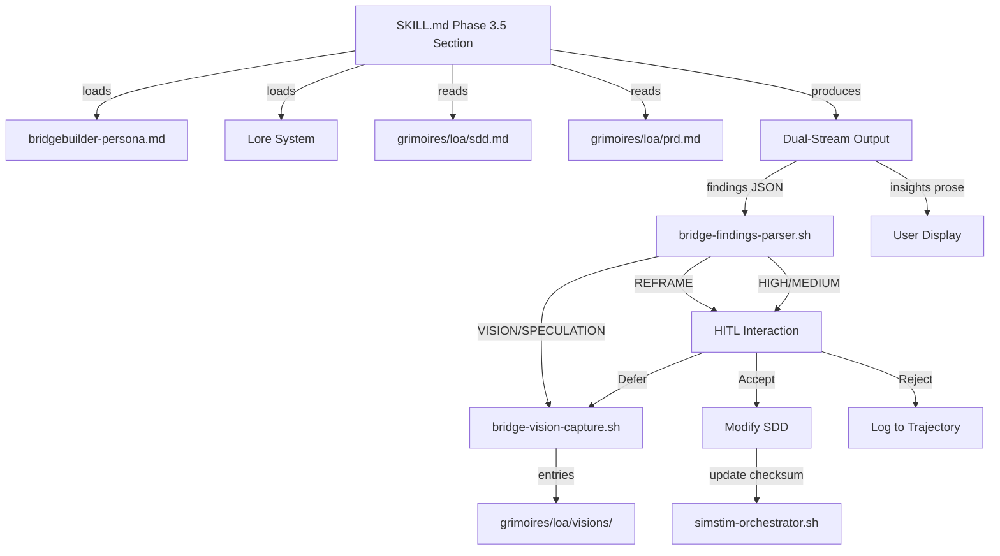

# SDD: Bridgebuilder Design Review — Pre-Implementation Architectural Intelligence

> **Cycle**: 044
> **Created**: 2026-02-28
> **PRD**: `grimoires/loa/prd.md`
> **Target**: `.claude/` System Zone (skills, scripts, data)

---

## 1. System Architecture

### 1.1 Phase Insertion Strategy

The new phase follows the **Red Team SDD (Phase 4.5) pattern**: a sub-phase implemented entirely in the SKILL.md with state tracking via `simstim-orchestrator.sh --update-phase`. This avoids modifying the `PHASES` array indices which would break `--from` flag mappings and `create_initial_state()` index arithmetic.

```
Simstim Phase Flow (updated):

Phase 0: PREFLIGHT
Phase 1: DISCOVERY (PRD)
Phase 2: FLATLINE PRD
Phase 3: ARCHITECTURE (SDD)
Phase 3.5: BRIDGEBUILDER SDD  ← NEW (sub-phase, like 4.5)
Phase 4: FLATLINE SDD
Phase 4.5: RED TEAM SDD (optional)
Phase 5: PLANNING (Sprint)
Phase 6: FLATLINE SPRINT
Phase 6.5: FLATLINE BEADS
Phase 7: IMPLEMENTATION
Phase 8: COMPLETE
```

**Why sub-phase, not array insertion**: The `PHASES` array drives `create_initial_state()` index arithmetic, `--from` flag case mappings (3 locations), and `force_phase()` validation. Inserting into the array shifts every subsequent index, breaking `--from architect` (currently index 3→would become 3, but `flatline_sdd` shifts from 4→5). The sub-phase pattern is proven (Red Team 4.5, Beads 6.5) and requires zero orchestrator array changes.

**Deviation from PRD FR-1 Implementation Strategy**: The PRD (FR-1, Implementation strategy) proposed full PHASES array insertion with schema_version bump to 2 and a v1→v2 migration function. This SDD deliberately chooses the sub-phase pattern instead because: (1) array insertion shifts all subsequent indices, breaking 3+ locations in the orchestrator, (2) schema migration adds complexity for a purely additive change, (3) the sub-phase pattern is proven by Red Team 4.5 and Beads 6.5 — neither of which appear in the PHASES array. The PRD should be amended to match this approach. This deviation was identified and accepted during SDD Flatline review (Phase 4).

### 1.2 Component Overview



### 1.3 Data Flow

```
1. Agent reads SDD + PRD + persona + lore
2. Agent generates review (dual-stream: findings JSON + insights prose)
3. Save full review to .run/bridge-reviews/design-review-{cycle}.md
4. Parse findings via bridge-findings-parser.sh
5. For each finding:
   - REFRAME → present to user (Accept minor/major, Reject, Defer)
   - HIGH/MEDIUM → present to user (Accept, Reject, Defer)
   - SPECULATION → present as "architectural alternatives" (Accept, Defer)
   - PRAISE → display to user
   - VISION → auto-capture to vision registry
6. If SDD was modified: update artifact checksum in simstim state
7. Proceed to Phase 4 (FLATLINE SDD)
```

---

## 2. Implementation Details

### 2.1 SKILL.md Phase 3.5 Section

Insert new section between `</phase_3_architecture>` and `<phase_4_flatline_sdd>` in `.claude/skills/simstim-workflow/SKILL.md`.

```markdown
<phase_3_5_bridgebuilder_sdd>
### Phase 3.5: BRIDGEBUILDER SDD (Design Review) [3.5/8]

Display: `[3.5/8] BRIDGEBUILDER SDD - Architectural design review...`

**Trigger conditions** (ALL must be true):
- `simstim.bridgebuilder_design_review: true` in `.loa.config.yaml`
- SDD exists (`test -f grimoires/loa/sdd.md`)

**Skip conditions** (any triggers skip):
- `simstim.bridgebuilder_design_review: false` (default)
- User chooses to skip when prompted
- SDD does not exist

**When triggered:**

1. **Update state**: `simstim-orchestrator.sh --update-phase bridgebuilder_sdd in_progress`

2. **Load persona**: Read `.claude/data/bridgebuilder-persona.md`

3. **Load lore** (if `bridgebuilder_design_review.lore_enabled: true`):
   Load lore entries using the same mechanism as Run Bridge Phase 3.1 step 3:
   read categories from `yq '.run_bridge.lore.categories[]' .loa.config.yaml`,
   then load matching entries from `grimoires/loa/lore/patterns.yaml` and
   `grimoires/loa/lore/visions.yaml`. Falls back gracefully to empty string
   if lore files do not exist.
   Note: There is no `lore-query.sh` script — lore loading is inline per
   the Run Bridge pattern, not via a dedicated script.

4. **Read artifacts**:
   - SDD: `grimoires/loa/sdd.md` (full document)
   - PRD: `grimoires/loa/prd.md` (for requirement traceability)

5. **Generate review**: Using the Bridgebuilder persona in design review mode,
   evaluate the SDD against 6 dimensions:
   - Architectural Soundness
   - Requirement Coverage (PRD → SDD mapping)
   - Scale Alignment
   - Risk Identification
   - Frame Questioning (REFRAME)
   - Pattern Recognition (ecosystem lore)

   Produce dual-stream output:
   - **Stream 1**: Structured findings JSON inside `<!-- bridge-findings-start/end -->` markers
   - **Stream 2**: Insights prose (architectural meditations, FAANG parallels)

6. **Save review**: Write to `.run/bridge-reviews/design-review-{cycle}.md` with 0600 permissions

7. **Parse findings**:
   ```bash
   .claude/scripts/bridge-findings-parser.sh \
     --input .run/bridge-reviews/design-review-{cycle}.md \
     --output .run/bridge-reviews/design-review-{cycle}.json
   ```

8. **HITL interaction** for each finding by severity:

   **REFRAME findings** (always presented):
   ```
   REFRAME: [title]
   [description]

   This questions the design framing, not the implementation.
   [A]ccept minor (modify SDD section)
   [A]ccept major (return to Architecture phase)
   [R]eject (log rationale)
   [D]efer (capture as vision)
   ```

   - Accept minor: Agent modifies the relevant SDD section in-place
   - Accept major: Mark SDD artifact as `needs_rework`, set
     `simstim-orchestrator.sh --update-phase architecture in_progress`,
     preserve REFRAME context to `.run/bridge-reviews/reframe-context.md`,
     return to Phase 3. **Circuit breaker**: Track rework count in
     `bridgebuilder_sdd.rework_count` (max 2). After 2 cycles,
     REFRAME findings are presented as accept-minor-only or auto-defer.
   - Reject: Log rationale to trajectory
   - Defer: Capture as vision entry

   **CRITICAL findings** (mandatory acknowledgment):
   ```
   CRITICAL: [title]
   [description]
   Design cannot satisfy a P0 requirement as specified.

   [A]ccept (modify SDD) / [R]eturn to Architecture / [R]eject (with rationale)
   ```

   **LOW findings** (informational, no action required):
   ```
   LOW: [title]
   [description]
   Minor suggestion — displayed for awareness.
   ```

   **HIGH/MEDIUM findings**:
   ```
   [severity]: [title]
   [description]
   Suggested change: [suggestion]

   [A]ccept (modify SDD) / [R]eject / [D]efer
   ```

   **SPECULATION findings**:
   ```
   SPECULATION: [title]
   [description]

   Architectural alternative to consider.
   [A]ccept (incorporate into SDD) / [D]efer (capture as vision)
   ```

   **PRAISE findings**: Display to user (no action needed)

   **VISION findings**: Auto-capture to vision registry (no user interaction)

9. **Vision capture** (if any VISION/SPECULATION findings and
   `bridgebuilder_design_review.vision_capture: true`):
   ```bash
   .claude/scripts/bridge-vision-capture.sh \
     --findings .run/bridge-reviews/design-review-{cycle}.json \
     --bridge-id "design-review-{simstim_id}" \
     --iteration 1 \
     --output-dir grimoires/loa/visions
   ```
   Note: `--pr` is omitted (optional argument). `--bridge-id` uses a
   design-review-prefixed identifier for provenance tracking.

10. **Update artifact checksum** (if SDD was modified):
    ```bash
    .claude/scripts/simstim-state.sh add-artifact sdd grimoires/loa/sdd.md
    ```
    Note: `add-artifact` overwrites existing entries with a fresh SHA256 checksum.
    There is no `update-artifact` command — `add-artifact` handles both create and update.

11. **Complete phase**:
    ```bash
    .claude/scripts/simstim-orchestrator.sh --update-phase bridgebuilder_sdd completed
    ```

**If skipped:**
- Log skip reason to state file
- Continue to Phase 4

Proceed to Phase 4.
</phase_3_5_bridgebuilder_sdd>
```

### 2.2 Chain Directive Updates

Update Phase 3 ending directive in SKILL.md:

**Before:**
```markdown
Proceed to Phase 4.
</phase_3_architecture>
```

**After:**
```markdown
Proceed to Phase 3.5 (if enabled) or Phase 4.
</phase_3_architecture>
```

### 2.3 Resume Jump Table Update

Add `bridgebuilder_sdd` to the resume jump table in SKILL.md:

```markdown
- `discovery` → Phase 1
- `flatline_prd` → Phase 2
- `architecture` → Phase 3
- `bridgebuilder_sdd` → Phase 3.5     ← NEW
- `flatline_sdd` → Phase 4
- `planning` → Phase 5
- `flatline_sprint` → Phase 6
- `implementation` → Phase 7
- `complete` → Phase 8 (already done)
```

### 2.4 Constraint Rule Update

Update the sequential constraint in **both** `.claude/data/constraints.json` (source of truth, constraint `C-PHASE-004`) and SKILL.md (generated):

**constraints.json `text_variants.skill-md` Before:**
```
Each phase MUST complete sequentially: 0→1→2→3→4→5→6→6.5→7→8
```

**After:**
```
Each phase MUST complete sequentially: 0→1→2→3→3.5→4→4.5→5→6→6.5→7→8
```

Note: The current constraint text is missing 4.5 (Red Team SDD). This update fixes that existing drift as well.

### 2.5 `force_phase()` Whitelist Update

**Design decision**: Existing sub-phases (Red Team 4.5 `red_team_sdd`, Beads 6.5 `flatline_beads`) are NOT in the `force_phase()` whitelist. For consistency, `bridgebuilder_sdd` is also NOT added to the whitelist. The `force_phase()` whitelist only contains phases in the `PHASES` array. Sub-phases are triggered by their parent phase's SKILL.md section, not by `--force-phase`.

**No changes** to `simstim-orchestrator.sh` `force_phase()`.

The **only change** to `simstim-orchestrator.sh` is: none. The sub-phase pattern requires zero orchestrator changes. The `PHASES` array, `PHASE_NAMES` array, `create_initial_state()`, `--from` mappings, and `force_phase()` whitelist all remain unchanged — consistent with how Red Team 4.5 and Beads 6.5 are implemented.

---

## 3. Findings Parser Extension

### 3.1 Add REFRAME to Severity Weight Map

In `.claude/scripts/bridge-findings-parser.sh`, update the severity weight map (line 30-38):

```bash
declare -A SEVERITY_WEIGHTS=(
  ["CRITICAL"]=10
  ["HIGH"]=5
  ["MEDIUM"]=2
  ["LOW"]=1
  ["VISION"]=0
  ["PRAISE"]=0
  ["SPECULATION"]=0
  ["REFRAME"]=0        # NEW
)
```

### 3.2 Add REFRAME to jq Weight Mapping

Update the inline jq at lines 354-364:

```jq
if .severity == "CRITICAL" then 10
elif .severity == "HIGH" then 5
elif .severity == "MEDIUM" then 2
elif .severity == "LOW" then 1
elif .severity == "VISION" then 0
elif .severity == "PRAISE" then 0
elif .severity == "SPECULATION" then 0
elif .severity == "REFRAME" then 0
else 0
end
```

### 3.3 Add REFRAME to by_severity Output

Update the empty-findings default (line 325-333) and the output construction (lines 382-400):

```json
{
  "by_severity": {
    "critical": 0,
    "high": 0,
    "medium": 0,
    "low": 0,
    "vision": 0,
    "praise": 0,
    "speculation": 0,
    "reframe": 0
  }
}
```

Add `--argjson reframe "$by_reframe"` to the jq construction and the corresponding key in the output object.

---

## 4. Design Review Prompt Template

### 4.1 File Location

`.claude/data/design-review-prompt.md` — referenced by the SKILL.md Phase 3.5 section.

### 4.2 Template Content

```markdown
# Bridgebuilder Design Review

You are the Bridgebuilder — reviewing a Software Design Document (SDD) before
implementation begins. Your role is not to design the system (that's the
architect's job), but to ask the questions that expand the design space.

## Review Context

- **SDD**: The document under review
- **PRD**: The requirements the SDD must satisfy
- **Lore**: Accumulated ecosystem patterns (if available)

## Evaluation Dimensions

### 1. Architectural Soundness
Does the design serve the requirements? Are the component boundaries clean?
Is the technology stack appropriate for the team and timeline?

### 2. Requirement Coverage
Does every PRD functional requirement map to an SDD component or section?
Are any P0 requirements missing from the design?

### 3. Scale Alignment
Do the NFR capacity targets match the architectural choices?
Will the design handle the stated load/volume/throughput?

### 4. Risk Identification
What could go wrong that the architect hasn't considered?
Are there single points of failure, missing fallbacks, or unhandled edge cases?

### 5. Frame Questioning (REFRAME)
Is this the right problem to solve? Could the requirements be better served
by a fundamentally different approach? Use REFRAME severity when you believe
the problem framing itself deserves reconsideration.

### 6. Pattern Recognition
Does the design follow or diverge from known ecosystem patterns?
Are divergences intentional and justified? Does lore suggest alternatives?

## Output Format

Produce dual-stream output per the Bridgebuilder persona:

**Stream 1 — Findings JSON** inside `<!-- bridge-findings-start -->` and
`<!-- bridge-findings-end -->` markers.

Each finding includes: id, title, severity, category, description, suggestion.
Optional enriched fields: faang_parallel, metaphor, teachable_moment.

The `file` field should reference SDD sections: `"grimoires/loa/sdd.md:Section 3.2"`.

Severity guide for design review:
- CRITICAL: Design cannot satisfy a P0 requirement as specified
- HIGH: Significant architectural gap or risk
- MEDIUM: Missing detail or suboptimal choice
- LOW: Minor suggestion or style
- REFRAME: The problem framing may need reconsideration
- SPECULATION: Architectural alternative worth exploring
- PRAISE: Genuinely good design decision worth celebrating
- VISION: Insight that should persist in institutional memory

**Stream 2 — Insights prose** surrounding the findings block.
Architectural meditations, FAANG parallels, ecosystem connections.

## Token Budget

- Findings: ~5,000 tokens (output)
- Insights: ~25,000 tokens (output)
- Total output budget: ~30,000 tokens (findings + insights)
- If output exceeds budget: truncate insights prose, preserve findings JSON
- Input context (persona + lore + PRD + SDD) is additional (~14K tokens)
```

---

## 5. Configuration

### 5.1 New Config Keys

Add to `.loa.config.yaml`:

```yaml
# Bridgebuilder Design Review (cycle-044)
bridgebuilder_design_review:
  enabled: false                # Default false — progressive rollout (sole gate)
  persona_path: ".claude/data/bridgebuilder-persona.md"  # FR-5.2: configurable persona
  lore_enabled: true            # Load lore context for reviews
  vision_capture: true          # Capture VISION/SPECULATION to registry
  token_budget:                 # Inherits run_bridge.bridgebuilder defaults
    findings_tokens: 5000
    insights_tokens: 25000
    total_tokens: 30000         # Output budget only (input context is additional)
```

Add under existing `simstim:` section:

```yaml
simstim:
  bridgebuilder_design_review: false  # Phase 3.5 gate
```

Place the `bridgebuilder_design_review:` top-level section after `run_bridge:` in `.loa.config.yaml`.

**Deferred configuration** (FR-5.5): `evaluation_dimensions` (configurable list of review dimensions) is deferred to keep MVP simple. The 6 dimensions are hardcoded in `design-review-prompt.md` with sensible defaults. Configurability will be added when standalone `/design-review` skill (FR-4) is implemented.

### 5.2 Config Precedence

**Single gate**: The phase triggers when `bridgebuilder_design_review.enabled: true`. The `simstim.bridgebuilder_design_review` key is a convenience alias that the Phase 3.5 SKILL.md section checks. If only one is set, the phase is skipped with a warning: "bridgebuilder_design_review.enabled is true but simstim.bridgebuilder_design_review is false (or vice versa) — design review will not run. Set both to true to enable."

This follows the pattern of existing features where the feature-level `enabled` is the primary gate and the simstim-level key controls whether it runs during the simstim workflow specifically.

### 5.3 Timeout

The PRD (NFR-1) specifies a 120-second hard timeout. Since the design review is generated by the agent itself (not by an external API call), a bash-level `timeout(1)` cannot be applied. The `timeout_seconds` config key is removed. Instead, the Phase 3.5 SKILL.md section includes an advisory note: "Target completion within 120 seconds. If the review is taking significantly longer, truncate insights prose and preserve findings JSON." This is consistent with how other agent-generated phases (e.g., Phase 3 Architecture) handle timing — they are advisory, not enforced.

---

## 6. Vision Capture Adaptation

### 6.1 bridge-vision-capture.sh Invocation

The script's `--pr` argument is already optional (not in the required-args check at line 197). The invocation uses synthetic values for required arguments:

```bash
.claude/scripts/bridge-vision-capture.sh \
  --findings .run/bridge-reviews/design-review-{cycle}.json \
  --bridge-id "design-review-{simstim_id}" \
  --iteration 1 \
  --output-dir grimoires/loa/visions
```

- `--bridge-id`: Uses `design-review-` prefix for provenance distinction from bridge runs
- `--iteration`: Always `1` (design review is a single pass, not iterative)
- `--pr`: Omitted (no PR exists at design review time)

The vision entry's `Source` field will read: `"Bridge iteration 1 of design-review-simstim-20260228-c044-..."` — clearly identifying this as a design review origin.

### 6.2 Script Modifications Required

**Deviation from initial analysis**: The existing `bridge-vision-capture.sh` filters exclusively on `.severity == "VISION"` (lines 211, 270, 291). SPECULATION findings are silently dropped. Since the PRD (FR-1.5, FR-3.5) and this SDD require SPECULATION capture, the jq filter must be updated.

**Change**: In `bridge-vision-capture.sh`, update all jq `select` filters from:
```jq
select(.severity == "VISION")
```
to:
```jq
select(.severity == "VISION" or .severity == "SPECULATION")
```

This affects 3 locations (lines 211, 270, 291).

**PRD FR-1.6 `--mode` flag**: The PRD proposed a `--mode design-review` flag. This SDD chooses synthetic arguments to the existing interface instead, avoiding a new code path. The `--bridge-id "design-review-{simstim_id}"` prefix provides equivalent provenance distinction. The same end result is achieved without adding a new flag to the script's argument parser.

---

## 7. State Schema

### 7.1 State Extension

The `bridgebuilder_sdd` phase is tracked dynamically via `update_phase()`, which creates the key in `.phases` on first write. No schema version bump is needed because:

1. `update_phase()` does not validate against the `PHASES` array (confirmed at line 913-949)
2. The new key is additive — existing tools that iterate `.phases` will include it naturally
3. Resume logic reads `.phase` (the top-level current-phase pointer) which works with any phase name

### 7.2 Example State After Phase 3.5

```json
{
  "schema_version": 1,
  "simstim_id": "simstim-20260228-c044-...",
  "state": "RUNNING",
  "phase": "flatline_sdd",
  "phases": {
    "preflight": {"status": "completed", ...},
    "discovery": {"status": "completed", ...},
    "flatline_prd": {"status": "completed", ...},
    "architecture": {"status": "completed", ...},
    "bridgebuilder_sdd": {"status": "completed", "started_at": "...", "completed_at": "..."},
    "flatline_sdd": {"status": "in_progress", "started_at": "..."},
    "planning": {"status": "pending"},
    "flatline_sprint": {"status": "pending"},
    "implementation": {"status": "pending"}
  }
}
```

---

## 8. File Manifest

| File | Action | Description |
|------|--------|-------------|
| `.claude/skills/simstim-workflow/SKILL.md` | Edit | Add Phase 3.5 section, update Phase 3 directive, update resume table, update constraint rule |
| `.claude/scripts/simstim-orchestrator.sh` | None | Zero changes — sub-phase pattern consistent with Red Team 4.5 / Beads 6.5 |
| `.claude/scripts/bridge-findings-parser.sh` | Edit | Add REFRAME to severity weight map, jq mapping, and by_severity output |
| `.claude/data/design-review-prompt.md` | Create | Design review prompt template for Bridgebuilder persona |
| `.loa.config.yaml` | Edit | Add `bridgebuilder_design_review` config section |
| `.claude/scripts/bridge-vision-capture.sh` | Edit | Update jq filter to include SPECULATION (3 locations: lines 211, 270, 291) |
| `.claude/data/constraints.json` | Edit | Update C-PHASE-004 `text_variants.skill-md` to include Phase 3.5 (and fix missing 4.5) |

**Files NOT modified:**
- `.claude/data/bridgebuilder-persona.md` — reused as-is
- `.claude/scripts/simstim-orchestrator.sh` — zero changes (sub-phase pattern, consistent with 4.5/6.5)
- `.claude/scripts/bridge-orchestrator.sh` — Run Bridge unchanged
- `.claude/scripts/flatline-orchestrator.sh` — Flatline unchanged

---

## 9. Testing Strategy

### 9.1 Unit Tests

| Test | Validates |
|------|-----------|
| `bridge-findings-parser.sh` with REFRAME severity findings | REFRAME counted in by_severity, weight 0 |
| `bridge-findings-parser.sh` with REFRAME in legacy markdown format | Default weight fallback handles REFRAME |
| `update_phase bridgebuilder_sdd in_progress` | State key created dynamically |
| `bridge-vision-capture.sh` with SPECULATION findings | SPECULATION entries captured (not just VISION) |
| Config gate: both flags false → phase skipped | Progressive rollout default |
| Config gate: only one flag true → phase skipped with warning | Mismatch detection |

### 9.2 Integration Tests

| Test | Validates |
|------|-----------|
| Full simstim flow with design review enabled | Phase 3.5 executes between 3 and 4 |
| Resume from `bridgebuilder_sdd` phase | Jump table routes correctly |
| SDD modification during Phase 3.5 → checksum update | No spurious drift in Phase 4 |
| REFRAME "accept major" → return to Phase 3 | State transition works |
| Vision capture with synthetic bridge-id | Entries created with correct provenance |

### 9.3 Acceptance Criteria

1. `simstim.bridgebuilder_design_review: true` + `bridgebuilder_design_review.enabled: true` → Phase 3.5 runs
2. Phase produces findings JSON parseable by `bridge-findings-parser.sh`
3. REFRAME findings presented to user with 4 options (accept minor/major, reject, defer)
4. Deferred findings appear in `grimoires/loa/visions/entries/`
5. Phase 4 (Flatline SDD) runs unchanged after Phase 3.5
6. Resume from `bridgebuilder_sdd` phase works (jump table + `update_phase` key creation)

---

## 10. Risks & Mitigation

| Risk | Mitigation |
|------|------------|
| Phase 3.5 state key missing on resume of pre-044 state files | `update_phase()` creates keys dynamically — no migration needed |
| Large SDD exceeds token budget | Same truncation as Run Bridge: summarize if >5K tokens |
| Review generates no actionable findings | Display "The Bridgebuilder found your design sound" + any PRAISE, continue |
| Bridgebuilder contradicts subsequent Flatline | User informed at Flatline phase; Flatline takes precedence for error detection |
| `bridge-vision-capture.sh` behavior with missing `--pr` | Already optional — tested by omitting argument |
| "Accept major" REFRAME infinite loop | Circuit breaker: max 2 Phase 3→3.5→3 cycles, then auto-defer |

---

## 11. Deferred Requirements

### FR-4: Standalone `/design-review` Skill (P2)

The PRD defines FR-4.1 through FR-4.5 for standalone invocation outside simstim. This is explicitly deferred to a future cycle. Prerequisites for implementation:

1. **New skill directory**: `.claude/skills/design-review/SKILL.md` — needs its own invocation, argument parsing, and state management independent of simstim
2. **State behavior**: Standalone mode has no simstim state file — needs either a lightweight state mechanism or stateless operation
3. **`/architect` integration**: FR-4.5 specifies opt-in quality gate during `/architect` — requires modifying the architect skill's SKILL.md to add a post-SDD hook
4. **Output destination**: Without simstim's `.run/` state, findings need a stable output location

When implemented, the standalone skill should share the design-review-prompt.md template and the same findings parser pipeline, diverging only in state management and invocation path.

### FR-5.5: Configurable Evaluation Dimensions

Deferred to keep MVP simple. The 6 evaluation dimensions are hardcoded in `design-review-prompt.md`. Configurability via `bridgebuilder_design_review.evaluation_dimensions` will be added alongside FR-4 to avoid premature abstraction.

---

## 12. Development Phases

### Sprint 1: Core Phase Integration
- Add Phase 3.5 section to SKILL.md (steps 1-7, 10-11: generation, parsing, checksum, completion)
- Update Phase 3 directive, resume table
- Update constraint rule in `.claude/data/constraints.json` (C-PHASE-004)
- Add REFRAME to findings parser (severity weight, jq mapping, by_severity, by_reframe computation)
- Update `bridge-vision-capture.sh` jq filters to include SPECULATION (3 locations)
- Create design-review-prompt.md
- Add config keys to `.loa.config.yaml`
- Create `.run/bridge-reviews/` directory (mkdir -p) in step 6

### Sprint 2: HITL Interaction + Vision Capture
- Add step 8 to Phase 3.5 SKILL.md (HITL interaction for all severity levels: CRITICAL, HIGH, MEDIUM, LOW, REFRAME, SPECULATION, PRAISE, VISION)
- Implement REFRAME accept minor/major/reject/defer state transitions with circuit breaker (max 2 rework cycles)
- Add step 9: Wire vision capture with synthetic bridge-id
- Implement SDD checksum update after modifications
- Test full simstim flow end-to-end

### Sprint 3: Hardening + Validation
- Resume support testing (bridgebuilder_sdd in jump table)
- Config gate validation (single gate with warning on mismatch)
- Graceful degradation on failure (skip to Phase 4 with warning)
- Run bridge iteration to validate quality of design review findings
- Add trajectory logging for vision capture events and lore loading
